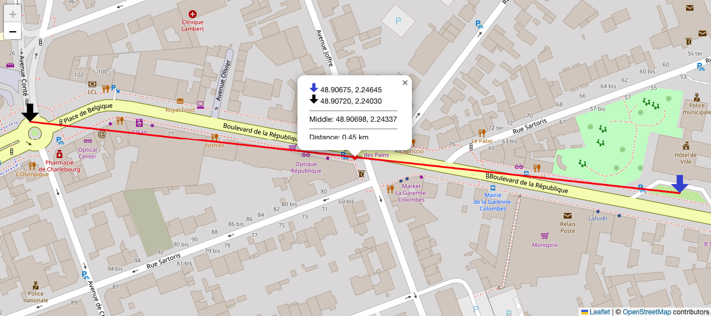
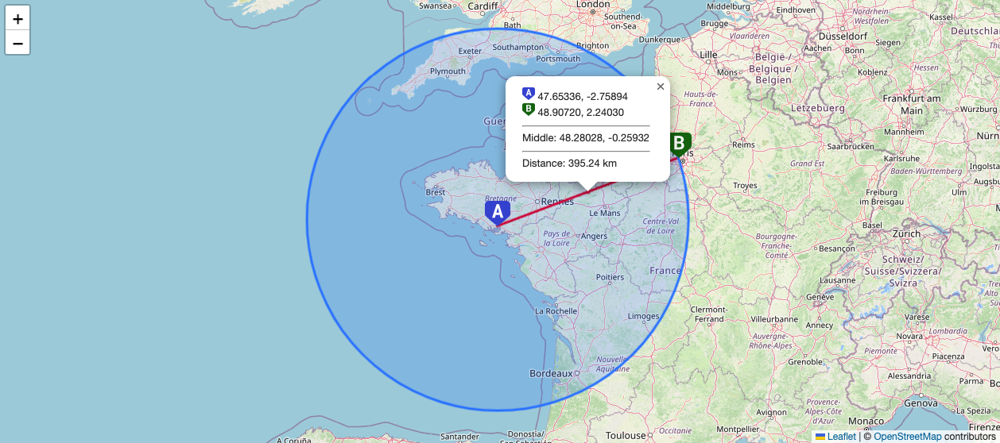

# Leaflet.MeasureDistance


**Leaflet.MeasureDistance** is a leaflet plugin for measuring distance between 2 points.

Made with ❤️ by [Richard Carlier](https://www.linkedin.com/in/rcarlier/) at _La Garenne Colombes_ (France).



## Usage

You need to include the `leaflet` CSS/JS and `Leaflet.MeasureDistance` JS

```html
<link rel="stylesheet" href="lib/leaflet.min.css" />

<script src="lib/leaflet.min.js"></script>
<script src="lib/leaflet.measureDistance.min.js"></script>
```

Add code after creating your map...

```js
L.control.measureDistance().addTo(map);
```

You can drag/drop both points...

## Options

| Options  | Type   | Option      | Default                           | Aim                                       |
| -------- | ------ | ----------- | --------------------------------- | ----------------------------------------- |
| `p1`     | Coords | recommended | `[48.90675, 2.24645]`             | Coords of first point, in Leaflet format  |
| `p2`     | Coords | recommended | `{lat:48.90714,lng:2.24037}`      | Coords of second point, in Leaflet format |
| `img1`   | URI    | optional    | blue arrow data:image/png;base64  | URI of first image to drag (32x32)        |
| `img2`   | URI    | optional    | black arrow data:image/png;base64 | URI of second image to drag (32x32)       |
| `circle` | Bool   | optional    | false                             | Show circle (p1 is the center)            |

```js
let options = {
    p1: [47.65336, -2.75894],
    p2: { lat: 48.9072, lng: 2.2403 },
    img1: "../assets/point_A.png",
    img2: "../assets/point_B.png",
    circle: true,
};

const map = L.map("map").setView(options.p1, 14);
L.tileLayer("https://{s}.tile.openstreetmap.org/{z}/{x}/{y}.png", {
    attribution:
        '&copy; <a href="https://www.openstreetmap.org/copyright">OpenStreetMap</a> contributors',
}).addTo(map);

L.control.measureDistance().addTo(map);
```



Enjoy!
